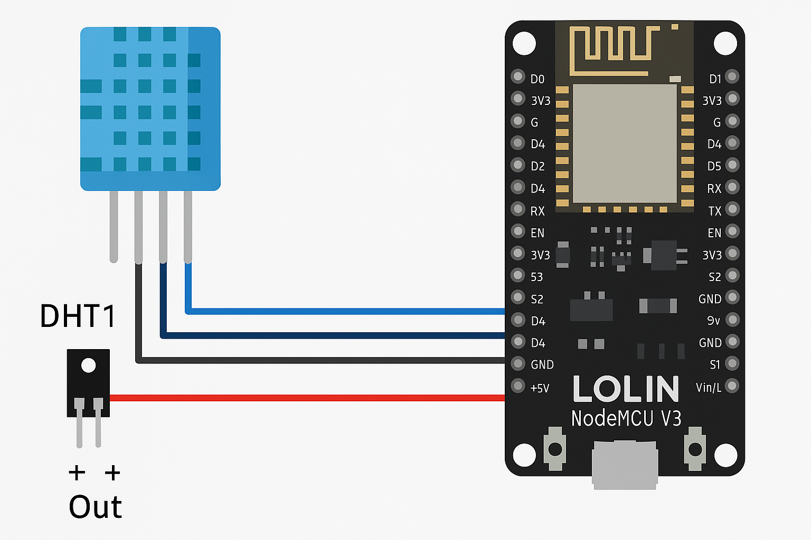

# JetNetAI Limited

## 

## roomTemp 🌡️ (NodeMCU Edition)

`roomTemp` (NodeMCU Edition) is a lightweight temperature and humidity monitoring system built using the Lolin NodeMCU V3 (ESP8266). It supports both LM36 analog temperature sensors and DHT11 temperature/humidity sensors. Data is sent to a local Flask API server for integration with JetNetAI’s smart home ecosystem, `agent-cisOne`.

---

## 🔧 Hardware

- [x] Lolin NodeMCU V3 (ESP8266)
- [x] LM36 analog temperature sensor (optional)
- [x] DHT11 temperature/humidity sensor
- [x] 3.3V power supply (from NodeMCU)
- [x] Wi-Fi access point (IoT subnet)

### 

---

## 📡 Features

- Supports static IP via firmware
- Auto-detects and polls DHT11 or LM36 based on config flag
- Periodic sensor updates
- Sends JSON via HTTP POST to Flask API
- Designed for multi-room, low-power deployments
- Fully compatible with JetNetAI smart home dashboard

---

## 📁 Project Structure

```
roomTemp-nodemcu/
├── include/
│   ├── env.h             # Wi-Fi credentials & static IP (gitignored)
│   └── dht11_sensor.h    # DHT11 sensor interface
├── src/
│   └── main.cpp          # Main firmware logic
├── assets/
│   └── nodemcu-dht11-wiring.png  # Wiring diagram
├── .gitignore
├── platformio.ini        # PlatformIO config for NodeMCU
└── README.md
```

---

## 🚀 Setup Instructions

1. **Clone this repo**

```bash
git clone https://github.com/your-username/roomTemp-nodemcu.git
cd roomTemp-nodemcu
```

2. **Create `include/env.h`**

```cpp
const char* ssid = "YOUR_WIFI_SSID";
const char* password = "YOUR_WIFI_PASSWORD";

IPAddress local_ip(172, 16, 2, 222);
IPAddress gateway(172, 16, 2, 1);
IPAddress subnet(255, 255, 255, 0);
IPAddress dns(1, 1, 1, 1);

const char* apiKey = "YOUR_API_KEY";
```

3. **Connect and Flash the NodeMCU**
   - Plug in the board via USB
   - Flash using PlatformIO (`Ctrl + Alt + U`)

4. **Start the Flask API server**
   - See [roomTemp-server](https://github.com/your-username/roomTemp-server)

---

## 🔒 Security

- Secrets like `env.h` are excluded from Git.
- Use separate Wi-Fi VLANs or firewall rules for IoT devices.
- Consider HTTPS for production deployments.

---

## 📦 Dependencies

- Arduino framework via PlatformIO
- Libraries: `ESP8266WiFi`, `ESP8266HTTPClient`, `DHT`
- Flask backend server for receiving sensor data

---

## 📅 Roadmap

- [ ] Add auto sensor detection
- [ ] Add logging and error feedback in UI
- [ ] Add OTA updates
- [ ] Integrate with cisOne for schedule-based control

---

## 🧠 Author

Michael Zampogna  
JetNetAI | Canberra, Australia  
[mrz@jetnetai.com](mailto:mrz@jetnetai.com)

---

## 📜 License

MIT License
